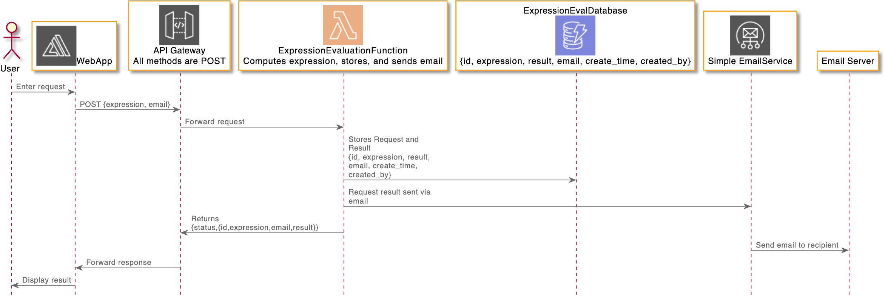

# -aws-e2e-smoke-tests
Smoke Tests for aws-e2e demo project

## dev
Open Suite locally `node_modules/cypress/bin/cypress open`

## Run the entire suite locally
`./node_modules/.bin/cypress run`

## System Architecture 

### TODO
* Pass the API key as environment variable, and set it up in CI (i.e export CYPRESS_MAILOSAUR_API_KEY=${cypress-api-key} <command> )
* Maybe add a UI to the DB.